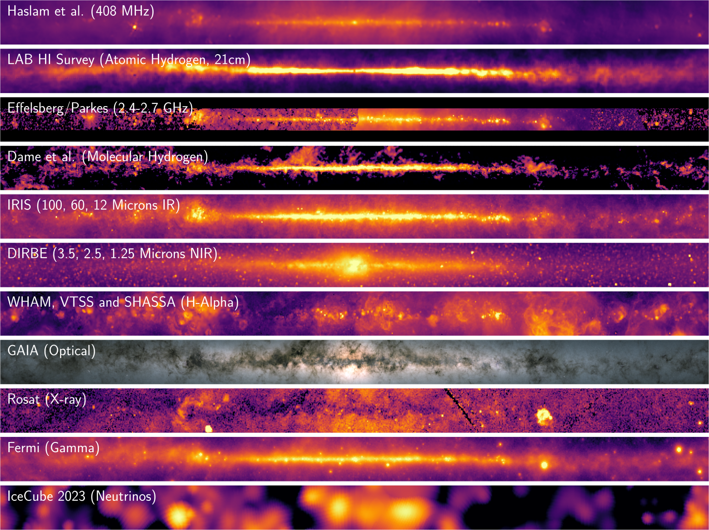

# Multi-Messenger Milky Way

A plot inspired by NASA's [Multiwavelength Milky Way](https://asd.gsfc.nasa.gov/archive/mwmw/mmw_sci.html) plot,
that also shows the recent observations of [neutrinos from the galactic plane](https://icecube.wisc.edu/news/press-releases/2023/06/our-galaxy-seen-through-a-new-lens-neutrinos-detected-by-icecube/) by the IceCube Neutrino Observatory. Some updated datasets are included compared to the original NASA plot, notably the Fermi LAT all-sky survey.



Note: The scripts and plot are still a work in progress and as such subject to change.


## Usage

Install the mamba environment that contains all the necessary packages using
```
$ mamba env create -f environment.yml
```
An installation of [miniforge](https://github.com/conda-forge/miniforge) is recommended. Additionally, make sure that `make` and `unzip` are installed.
To download the data files run
```
$ make download
```
After all files are downloaded, you can build the plot using `make all` or
```
$ make build/multi_messenger.pdf
```
The plot can be found in the build directory.


## Data

Data for each subplot is taken from the following Surveys and is in the [HEALPix](https://healpix.sourceforge.io/) FITS data format:
- [2014 Reprocessed Haslam 408 MHz Survey](https://lambda.gsfc.nasa.gov/product/foreground/fg_LAB_HI_Survey_info.html): <p>Remazeilles et al.
***"An improved source-subtracted and destriped 408 MHz all-sky map"***, MNRAS 451, 4311 (2015).</p>
- [LAB Survey](https://lambda.gsfc.nasa.gov/product/foreground/fg_LAB_HI_Survey_info.html): <p>Kalbera et al. ***"Leiden/Argentine/Bonn (LAB) Survey of Galactic HI"***, Astron. Astrophys., 440, 775 (2005);</p> <p>Land et al ***"Correlation between galactic HI and the Cosmic Microwave Background"***, arXiv:0706.1703, PRD in print.</p>
- [S-PASS 2.3 GHz Survey](https://lambda.gsfc.nasa.gov/product/foreground/fg_s_pass_info.html): <p>Caretti et al., ***"S-band Polarization All Sky Survey (S-PASS): survey description and maps"***, arXiv:1903.09420.</p>
- [Effelsberg Radio Continuum Survey](http://cade.irap.omp.eu/dokuwiki/doku.php?id=effelsberg): <p>Reich et al., ***"A radio continuum survey of the galactic plane at 11 cm wavelength. I. The area 357.4 < or = L < or = 76, - 1.5 < or = B < or = 1.5."***, A&A, Suppl. Ser., Vol. 58, pp. 197-248 (1984);</p> <p>Reich et al., ***"A radio continuum survey of the Galactic Plane at 11 cm wavelength. II. The area 358deg <= L <= 76deg, -5deg <= B <= 5deg"***, A&A, Suppl. Ser., Vol. 85, pp. 633-690 (1990);</p> <p>Fürst et al., ***"A radio continuum survey of the Galactic Plane at 11 cm wavelength. III. The area 76deg <= L <= 240deg, -5deg <= B <= 5deg"***, A&A, Suppl. Ser., Vol. 85, pp. 691-803 (1990).</p>
- [Dame et al. 2001 Velocity Integrated CO Map](https://lambda.gsfc.nasa.gov/product/foreground/fg_wco_info.html): <p>Dame et al., ***"The Milky Way in Molecular Clouds: A New Complete CO Survey"***, The Astrophysical Journal, Vol. 547, Issue 2, pp. 792-813 (2001).</p>
- [IRIS Infrared Survey](https://lambda.gsfc.nasa.gov/product/foreground/fg_iris_info.html): <p>Miville-Deschênes et al., ***"IRIS: A New Generation of IRAS Maps"***, The Astrophysical Journal, Suppl. Ser., Vol. 157, Issue 2, pp. 302-323 (2005).</p>
- [Diffuse Infrared Background Experiment (DIRBE)](http://cade.irap.omp.eu/dokuwiki/doku.php?id=dirbe): <p>Hauser et al., ***"The COBE Diffuse Infrared Background Experiment Search for the Cosmic Infrared Background. I. Limits and Detections"***, The Astrophysical Journal, Vol. 508, Issue 1, pp. 25-43 (1998);</p> <p>Kelsall et al., ***"The COBE Diffuse Infrared Background Experiment Search for the Cosmic Infrared Background. II. Model of the Interplanetary Dust Cloud"***, The Astrophysical Journal, Vol. 508, Issue 1, pp. 44-73 (1998);</p> <p>Arendt et al., ***"The COBE Diffuse Infrared Background Experiment Search for the Cosmic Infrared Background. III. Separation of Galactic Emission from the Infrared Sky Brightness"***, The Astrophysical Journal, Vol. 508, Issue 1, pp. 74-105 (1998);</p> <p>Dwek et al., ***"The COBE Diffuse Infrared Background Experiment Search for the Cosmic Infrared Background. IV. Cosmological Implications"***, The Astrophysical Journal, Vol. 508, Issue 1, pp. 106-122 (1998).</p>
- [Composite All-Sky H-Alpha](https://lambda.gsfc.nasa.gov/product/foreground/fg_halpha_info.html): <p>Finkbeiner, D., ***"A Full-Sky Hα Template for Microwave Foreground Prediction"***, The Astrophysical Journal, Suppl. Ser., Vol. 146, Issue 2, pp. 407-415 (2003)</p>
- [GAIA All-Sky Survey](https://sci.esa.int/s/ApPJaGA): <p>***Gaia Data Processing and Analysis Consortium (DPAC)***; A. Moitinho / A. F. Silva / M. Barros / C. Barata, University of Lisbon, Portugal; H. Savietto, Fork Research, Portugal</p>
- [ROSAT Survey](https://www.jb.man.ac.uk/research/cosmos/rosat/): <p>Snowden et al., ***"ROSAT Survey Diffuse X-Ray Background Maps. II."***, 
The Astrophysical Journal, Vol. 485, Issue 1, pp. 125-135 (1997).</p>
- [Fermi LAT All-Sky Survey](https://fermi.gsfc.nasa.gov/ssc/data/access/lat/): (Weekly Photon Files): ***Fermi LAT Collaboration***
- [IceCube Observations of High-Energy Neutrinos From the Galactic Plane](https://icecube.wisc.edu/data-releases/2023/06/observation-of-high-energy-neutrinos-from-the-galactic-plane/): <p>IceCube Collaboration, ***"Observation of high-energy neutrinos from the Galactic plane"***, Science, Vol. 380, Issue 6652, pp. 1338-1343 (2023).

